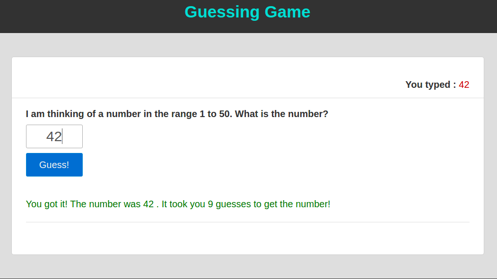

# Guessing Game Tutorial #
**Last Update on: 23.11.2016 11:22:04**
## Step 1: Make an HTML file



Make a new directory in your local storage called _**guessing-game**_ and create **index.html** inside the directory. You can place below html markup in your newly created html file,

```
<!DOCTYPE html>
<html lang="en">
<head>
  <meta charset="UTF-8">
  <title>Guessing Game</title>
  <link rel="stylesheet" href="style.css">
</head>
<body>
  <header class="header">
    <div class="container">
      <h1>Guessing Game</h1>
    </div>
  </header>

  <main class="main">
    <div class="container">
      <div class="content">
        <div class="userInputStatus">You typed : <span id="userInput">None</span></div>
        <label for="userInput">I am thinking of a number in the range 1 to 50. What is the number?</label>
        <input type="text" name="userInput" id="userInputValue" onkeyup="get_input(this.value);" autofocus>
        <input type="button" value="Guess!" id="guess" onclick="do_guess()">
        <div class="status" id="status">Feedback: Click Guess button to play the game!</div>
      </div>
    </div>
  </main>

  <footer class="footer">
    <div class="container">&copy; Guessing Game - Created By <a href="#">You</a></div>
  </footer>
  <script src="function.js"></script>
</body>
</html>
```

We added external stylesheet inside the head tag and after the title element. Also we added external script tag before the end body tag. We added header, main, footer semantic tag for html5\. It is not required, but for the visual effect we made this. Inside the content class element we made two input element, one is a text input and another is button input element. You will see we made a div tag with `userInputStatus` id. When user start typing in text input element it will update user input. I made a label element to show the question to the user. If yo carefully read all attributes of that text input element you will notice that I gave two new attribute which need to be explained here. First one is `onkeyup="get_input(this.value)"`. Well `onkeyup` is an event handler when user start typing it will then call a function. And the function is `get_input(this.value)`. I provided `this.value` parameter in `get_input` function as because whenever anything is typed in the text input element it stores the input value. When you reading this tutorial a question will appear in your mind _What is event handler?_ Here is a quote from www.webopedia.com/:

> An **event handler** typically is a software routine that processes actions such as keystrokes and mouse movements. With Web sites, event handlers make Web content dynamic. JavaScript is a common method of scripting event handlers for Web content.

Event handler is an action when any action happens it will then fires up provided function. Some useful event handlers are:

*   onclick
*   onmouseover
*   oncopy
*   onblur
*   onfocus
*   onpaste
*   onkeyup
*   onkeydown
*   onmouseenter
*   onmousedown
*   onmouseleave
*   onmousewheel
*   onmousemove
*   onmouseout
*   onmouseover

We provided another event handler on button input element which is `onclick="do_guess()`. Whenever user clicks to the button element it fires up `do_guess` function. After the button element we added a div element with status id attribute. It will give feedback to the user if the answer is not a number/answer is too large or small/congratulation message.

## Step 2: Making a external styelesheet file for visual effect

Now make a **style.css** file inside the directory and paste below code in the file.
```
body {
  font-family: Arial, Helvetica, sans-serif;
  font-size: 14px;
  background: #dedede;
  color: #333;
  line-height: 1.4em;
}

* {
  margin: 0;
  padding: 0;
  -webkit-box-sizing: border-box;
  -moz-box-sizing: border-box;
  box-sizing: border-box;
}

a {
  color: #006ec3;
  text-decoration: none;
}

a:hover {
  text-decoration: none;
}

.clear:after {
  clear: both;
}

.clear:before,
.clear:after {
  display: table;
  content: '';
}

.container:after {
  clear: both;
}

.container:before,
.container:after {
  display: table;
  content: '';
}

.container {
  max-width: 1000px;
  width: 100%;
  margin: 0 auto;
}

.header {
  background: #323232;
  padding: 1em 0;
  text-align: center;
}

.header h1 {
  font-size: 2.5em;
  line-height: 1.8em;
  color: #00ded2;
}

.main {
  padding: 50px 0;
}

.content {
  background: #fff;
  border: 1px solid #cecece;
  padding: 30px;
  border-radius: 5px;
  position: relative;
  min-height: 420px;
  font-size: 20px;
  line-height: 1.8em;
}

.userInputStatus {
  border-bottom: 1px solid #dedede;
  padding: 10px 30px;
  margin: 0 -30px 15px -30px;
  font-weight: bold;
  text-align: right;
}

#userInput {
  font-weight: 300;
  color: #cd0000;
}

label {
  display: block;
  margin: 5px 0;
  font-weight: bold;
}

input[type=text] {
  display: block;
  width: 120px;
  height: 50px;
  border-radius: 3px;
  outline: none;
  border: 1px solid #adadad;
  padding: 5px 8px;
  font-size: 30px;
  text-align: center;
  margin: 0 0 10px 0;
  color: #555;
}

.footer {
  background: #323232;
  padding: 0.8em 0;
  text-align: center;
  color: #fff;
}

.footer a {
  color: #ddecde;
  text-decoration: none;
}

input[type=button] {
    display: block;
    width: 120px;
    height: 50px;
    margin: 10px 0;
    padding: 8px 10px;
    font-size: 20px;
    background: #006ed2;
    border: 1px solid #0089d2;
    color: #efefef;
    cursor: pointer;
    border-radius: 3px;
    transition: all ease 0.3s;
}

input[type=button]:hover {
    background: #057D25;
}

.status {
    margin: 20px 0 10px;
    border-bottom: 1px solid #ddd;
    padding: 20px 0;
    color: #006ED2;
}

.error {
  color: #de0000;
}

.success {
  color: #017701;
}

.animated {
    -webkit-animation-duration: 0.5s;
    animation-duration: 0.5s;
    -webkit-animation-fill-mode: both;
    animation-fill-mode: both;
    -webkit-animation-timing-function: linear;
    animation-timing-function: linear;
}

@-webkit-keyframes shake {
    0%, 100% {-webkit-transform: translateX(0);}
    10%, 30%, 50%, 70%, 90% {-webkit-transform: translateX(-10px);}
    20%, 40%, 60%, 80% {-webkit-transform: translateX(10px);}
}
@keyframes shake {
    0%, 100% {transform: translateX(0);}
    10%, 30%, 50%, 70%, 90% {transform: translateX(-10px);}
    20%, 40%, 60%, 80% {transform: translateX(10px);}
}
.shake {
    -webkit-animation-name: shake;
    animation-name: shake;
}

@-webkit-keyframes bounce {
    0%, 20%, 50%, 80%, 100% {-webkit-transform: translateY(0);}
    40% {-webkit-transform: translateY(-30px);}
    60% {-webkit-transform: translateY(-15px);}
}

@keyframes bounce {
    0%, 20%, 50%, 80%, 100% {transform: translateY(0);}
    40% {transform: translateY(-30px);}
    60% {transform: translateY(-15px);}
}

.bounce {
    -webkit-animation-name: bounce;
    animation-name: bounce;
}
```

## Step 3: Make a new javascript file for content behavior

Inside the directory create a file called **function.js** and paste below code.

```
// Initial variables
var guess_input_text,        // user input
  guess_input,               // modified user input
  finished = false,          // a finished variable with false value
// to be used in if statement
  guesses = 0,               // guesses variable to be count.
// Initial value is zero
  target = Math.floor( Math.random() * 50 ) + 1; // our target variable
// which will be our guessing number

function get_input( showValue ) { // a function with showValue parameter
// to get user input from the text input
  document.getElementById( 'userInput' ).innerHTML = showValue; // showing the typed value
//in userInput div element
  guess_input_text = showValue;  // stores input value in
//guess_input_text variable
}

function do_guess() { // this function will be used to process the guessing game

  if( !finished ){ // it checks if finished variable contains true or false value
    guess_input = parseInt( guess_input_text ); // it checks if the user input
// is an integer or a string
    guesses++; // increases the value of guesses variable from 0 like 1, 2, 3, ...
    document.getElementById( "userInputValue" ).focus(); // If user input is false
// then it will autofocus again in input text field
    finished = check_guess(); // now finished variable stores a new function
// check_guess
  }

}

// This function checks if the user input is invalid
function check_guess() {
  var status = document.getElementById( 'status' ); // a local variable to identifies
// the div element with status id

  if ( isNaN( guess_input ) ) { // it checks if the given user input is a number
    status.innerHTML = '<span class="error animated shake">You have not entered a number. Please enter a number in the range 1 to 50.</span>' ;
    return false; // if the given input is not a number it gives a feedback to the user and returns false value
  }

  if( guess_input < 1 || guess_input > 50 ){ // it checks if the given user input is
// less than one or greater than 50
    status.innerHTML = '<span class="error animated shake">Please enter a number in the range 1 to 50.</span>';
    return false; // if it fails then it gives feedback to the
// user and returns false value
  }

  if ( guess_input < target ) { // now it checks if the user input is less than target
// variable, if it fails then it returns false value gives feedback to the user
    status.innerHTML = '<span class="error animated shake">Your number is too small!</span>';
    return false;
  }

  if( guess_input > target ){// now it checks if the user input is greater than
// target variable, if it fails then it returns false value gives feedback to the user
    status.innerHTML = '<span class="error animated shake">Your number is too large!</span>';
    return false;
  }

// now it passed all validation, it shows a congratulate message to the user and also shows how many guesses user tried with the guessing number
  status.innerHTML = "<span class=\"success animated bounce\">You got it! The number was " + target + " . It took you " + guesses + " guesses to get the number!</span>";
  return true;

}
```

Explanation given in the script itself.
